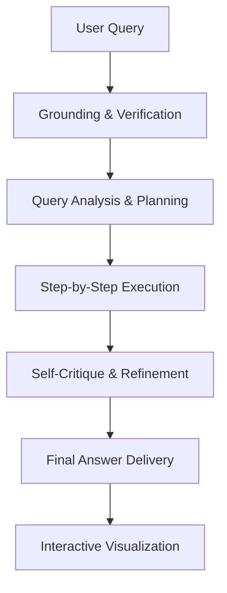

# 🤖 Data Scientist AI Agent

An intelligent and collaborative Data Scientist AI Agent powered by Google Gemini that transforms natural language queries into comprehensive data analysis and interactive visualizations.

## ✨ Key Features

### 🧠 **Intelligent Analysis**
- **Natural Language Processing**: Ask complex questions about your data in plain English
- **5-Step Reasoning Process**: Grounding → Planning → Execution → Critique → Delivery
- **Interactive Clarification**: Agent asks for clarification when queries are ambiguous
- **Fuzzy Column Matching**: Intelligent column name resolution and suggestions

### 📊 **Advanced Visualizations**
- **Interactive Plotly Charts**: Bar, line, scatter, histogram, box plots, and more
- **Complex Visualizations**: Sunburst, treemaps, 3D plots, correlation matrices
- **Real-time Rendering**: Seamless integration with Streamlit interface
- **Export Capabilities**: Save charts and analysis results

### 🔬 **Machine Learning & Statistics**
- **Advanced Analytics**: Statistical summaries, correlations, trend analysis
- **ML Models**: XGBoost, clustering, predictions, feature importance
- **Model Explainability**: SHAP values, LIME explanations
- **Time Series Analysis**: Forecasting with Prophet and ARIMA

### 🛡️ **Production-Ready Features**
- **Secure Code Execution**: Sandboxed Python environment with persistent variables
- **Rate Limiting**: Intelligent API usage management (8-12 requests/min)
- **Error Handling**: Graceful degradation and comprehensive error recovery
- **Comprehensive Testing**: 50-question automated test suite

### 🧪 **Testing & Quality Assurance**
- **Automated Test Suite**: 50 carefully crafted questions across 5 categories
- **Performance Metrics**: 4-criteria evaluation system with 75% pass threshold
- **Real-time Monitoring**: Streamlit dashboard for test execution and results
- **Category Analysis**: Data understanding, visualization, statistical analysis

## 🔧 Prerequisites

- **Python 3.9+**
- **Google Gemini API key** ([Get yours here](https://makersuite.google.com/app/apikey))
- **(Optional)** LangSmith API key for observability and debugging

## 🚀 Quick Start

### Method 1: Automated Setup (Recommended)

1. **Clone and setup**:
   ```bash
   git clone <your-repo-url>
   cd windsurf-project
   python setup.py
   ```

2. **Configure API key**:
   ```bash
   cp .env.example .env
   # Edit .env and add your Google Gemini API key
   ```

3. **Launch the application**:
   ```bash
   # Windows:
   run_venv.bat
   
   # Unix/Linux/macOS:
   ./run_venv.sh
   ```

### Method 2: Manual Setup

1. **Create virtual environment**:
   ```bash
   python -m venv venv
   
   # Activate environment
   # Windows:
   venv\Scripts\activate
   # Unix/Linux/macOS:
   source venv/bin/activate
   ```

2. **Install dependencies**:
   ```bash
   pip install -r requirements.txt
   ```

3. **Set up environment variables**:
   ```bash
   # Create .env file
   echo "GOOGLE_API_KEY=your_api_key_here" > .env
   ```

4. **Run the application**:
   ```bash
   streamlit run src/app.py
   ```

### 🔑 API Key Setup

1. Visit [Google AI Studio](https://makersuite.google.com/app/apikey)
2. Click "Create API Key" 
3. Copy your API key
4. Add to `.env` file: `GOOGLE_API_KEY=your_key_here`

> **Security Note**: Never commit your `.env` file to version control

## 💻 Usage

### 🌐 **Web Interface**

1. **Upload your data**: Support for CSV and Excel files
2. **Ask questions**: Use natural language queries like:
   - "Show me a bar chart of sales by region"
   - "What's the correlation between price and sales?"
   - "Create a scatter plot with trend line"
   - "Predict next month's revenue using machine learning"

3. **Interactive analysis**: The agent will clarify ambiguous requests and provide step-by-step analysis

### 📝 **Example Queries**

```
📊 Visualization:
• "Create a histogram of customer ages"
• "Show sales trends over time with a line chart"
• "Make a correlation heatmap of all numeric columns"

🔍 Analysis:
• "What are the top 5 products by revenue?"
• "Calculate the average order value by customer segment"
• "Find outliers in the pricing data"

🤖 Machine Learning:
• "Build a model to predict customer churn"
• "Cluster customers based on their behavior"
• "Show feature importance for sales prediction"
```

### 🧪 **Testing Your Agent**

Run the comprehensive test suite to evaluate performance:

```bash
# Quick test (10 questions)
python run_tests.py

# Full test suite (50 questions)
# Select option 2 when prompted

# Interactive testing dashboard
streamlit run src/testing/test_app.py
```

**Test Categories:**
- Data Understanding (10 questions)
- Basic Visualization (10 questions) 
- Advanced Analysis (10 questions)
- Complex Visualization (10 questions)
- Statistical Analysis (10 questions)

The application opens at `http://localhost:8501`

## 📁 Project Structure

```
windsurf-project/
├── src/
│   ├── app.py                    # 🌐 Main Streamlit application
│   ├── agent.py                  # 🤖 ReAct agent with 5-step reasoning
│   ├── utils.py                  # 🛠️ Data processing & visualization utilities
│   ├── query_analyzer/           # 🧠 Query analysis & clarification system
│   │   ├── __init__.py
│   │   ├── main.py              # Query analysis logic
│   │   ├── prompts.py           # LLM prompt templates
│   │   └── schemas.py           # Pydantic data models
│   └── testing/                  # 🧪 Comprehensive test suite
│       ├── __init__.py
│       ├── test_questions.py    # 50 test questions bank
│       ├── test_runner.py       # Automated test execution
│       ├── results_analyzer.py  # Results analysis & visualization
│       └── test_app.py         # Streamlit testing dashboard
├── docs/                        # 📚 Documentation files
│   ├── SETUP_GUIDE.md          # Detailed setup instructions
│   ├── TESTING_README.md       # Testing framework guide
│   └── RATE_LIMITING_GUIDE.md  # API usage management
├── run_tests.py                 # 🚀 Quick test runner
├── setup.py                     # 🔧 Automated setup script
├── .env.example                 # 🔐 Environment variables template
├── .gitignore
├── README.md
└── requirements.txt             # 📦 Python dependencies
```

## 🏗️ Architecture

### Core Components

1. **Streamlit Frontend** (`app.py`): Interactive web interface with file upload and chat
2. **ReAct Agent** (`agent.py`): LangChain-powered agent with 5-step reasoning process
3. **Query Analyzer** (`query_analyzer/`): Intent classification and clarification system
4. **Testing Suite** (`testing/`): Automated evaluation with 50 diverse questions
5. **Utilities** (`utils.py`): Data processing and Plotly visualization helpers

### Agent Workflow



## 🔧 Advanced Configuration

### Rate Limiting
```python
# Adjust API rate limits (default: 8 requests/min)
runner = TestRunner(df, rate_limit_requests=10)
```

### Custom Agent Settings
```python
# Modify agent behavior in agent.py
agent = DataScientistAgent(df)
agent.llm.temperature = 0.2  # Adjust creativity
```

### Environment Variables
```bash
# .env file configuration
GOOGLE_API_KEY=your_api_key_here
LANGCHAIN_API_KEY=your_langsmith_key  # Optional
LANGCHAIN_TRACING_V2=true            # Optional
DEBUG=True                           # Enable debug mode
```

## 🚨 Troubleshooting

### Common Issues

**API Key Errors:**
```bash
# Verify API key is set
python -c "import os; from dotenv import load_dotenv; load_dotenv(); print('✅ API Key found!' if os.getenv('GOOGLE_API_KEY') else '❌ API Key missing!')"
```

**Rate Limiting:**
- Reduce concurrent requests in test runner
- Use conservative rate limits (5-8 requests/min)
- Check for other API usage

**Memory Issues:**
```python
# Sample large datasets
df_sample = df.sample(n=1000)
```

**Import Errors:**
```bash
# Reinstall dependencies
pip install -r requirements.txt --force-reinstall
```

## 📊 Performance Benchmarks

| Test Category | Target Pass Rate | Avg Execution Time |
|---------------|------------------|-------------------|
| Data Understanding | >90% | <5s |
| Basic Visualization | >85% | <8s |
| Advanced Analysis | >75% | <12s |
| Complex Visualization | >70% | <15s |
| Statistical Analysis | >65% | <20s |

## 🤝 Contributing

1. Fork the repository
2. Create a feature branch (`git checkout -b feature/amazing-feature`)
3. Run tests (`python run_tests.py`)
4. Commit changes (`git commit -m 'Add amazing feature'`)
5. Push to branch (`git push origin feature/amazing-feature`)
6. Open a Pull Request

### Development Setup
```bash
# Install development dependencies
pip install -r requirements.txt
pip install pytest black flake8

# Run code formatting
black src/
flake8 src/
```

## 📄 License

This project is licensed under the MIT License - see the [LICENSE](LICENSE) file for details.

## 🙏 Acknowledgments

- **AI/ML Stack**: [LangChain](https://python.langchain.com/) + [Google Gemini](https://ai.google.dev/)
- **Frontend**: [Streamlit](https://streamlit.io/) for rapid prototyping
- **Visualization**: [Plotly](https://plotly.com/) for interactive charts
- **Data Science**: [Pandas](https://pandas.pydata.org/), [Scikit-learn](https://scikit-learn.org/), [XGBoost](https://xgboost.readthedocs.io/)

## 🔗 Related Documentation

- [📚 Setup Guide](docs/SETUP_GUIDE.md) - Detailed installation instructions
- [🧪 Testing Guide](docs/TESTING_README.md) - Comprehensive testing framework
- [🚦 Rate Limiting](docs/RATE_LIMITING_GUIDE.md) - API usage management

---

**Ready to transform your data analysis workflow with AI?** 🚀📊🤖
